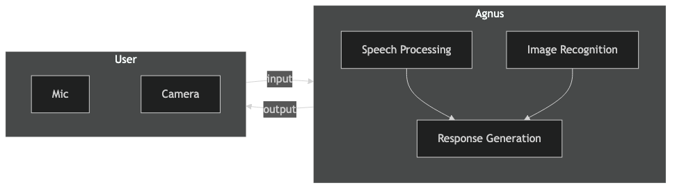

<figure class="post-figure">
  
  <figcaption>Agnus displayed at the Generative Machine Learning Exhibition.</figcaption>
</figure>

For the Generative Machine Learning course at The Cooper Union, my team created Agnus, an interactive AI agent that brings internet troll behavior into physical space. We asked: what if you could interact with a troll in person? The result was an installation that could see, hear, and verbally roast exhibition attendees in real time.

The installation featured an LED wall displaying an animated troll created by Ben Butler, paired with a webcam, dynamic microphone, and speakers. Using the Gemini 2.5 Live API, we streamed real-time video and audio through WebSockets, allowing Agnus to craft personalized insults based on what it saw and heard. A Gradio interface enabled seamless session control.

<figure class="post-figure">
  
  <figcaption>System architecture showing real-time audio-video streaming with sub-second latency.</figcaption>
</figure>

The exhibition revealed how quickly multimodal AI has evolved. While most attendees were familiar with chatbots and image generators, real-time audio-visual interaction caught them off guard. Visitors laughed nervously as Agnus identified embarrassing details and made sharp observations based on their appearance and voice. This project taught me about latency optimization, personality tuning through prompt engineering, and how combining visual and audio cues creates a more convincing presence than text-based systems alone.

  <a href="https://github.com/toribiodiego/ECE-471-Generative-Machine-Learning/tree/main/Final_Project">Code</a>

