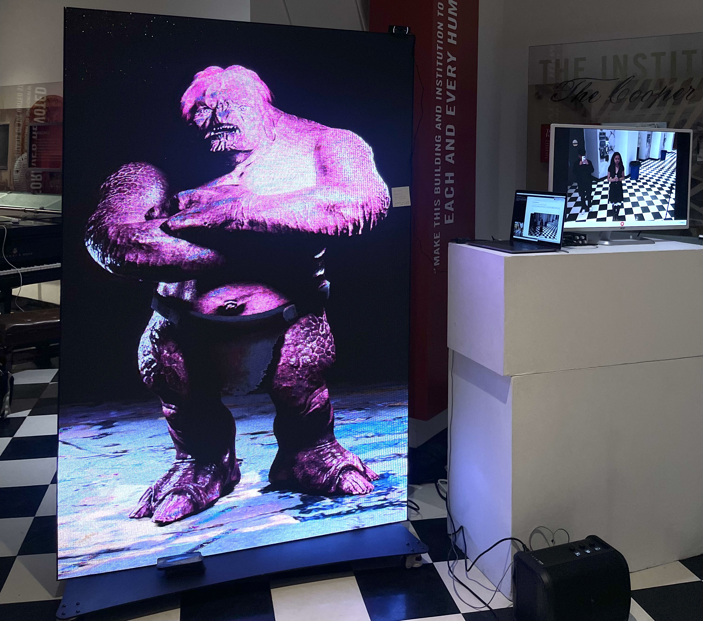
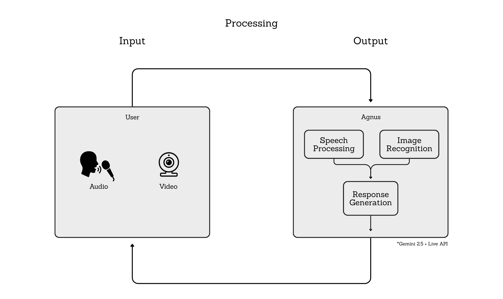

<figure class="post-figure">
  
  <figcaption>Agnus displayed at the Generative Machine Learning Exhibition.</figcaption>
</figure>

Paragraph 1:

What was this project created for, adn who was it made with?

- During my Senior Spring Semester (Spring 25') I worked on a project called *Agnes* for the Generative Machine Learning at The Cooper Union.
- The course is a interdisciplinary graduate courses co-taught by Professors. Sam Keene and Benjamin Aranda where art, architecture, and engineering students create generative machine learning projects.

What was the main idea or creative goal?    

- For our final project my group posed the question: "what if you could interact with a troll" 
- The idea was to use generative ai to create an internet troll that attendees at the exhibition could interact with.
- The idea is that the internet troll could see you and make fun of you in real time.

What was the main idea or behavior you wanted people to experience?  

- For our final we were asked to create an interactive and generative project that would be displayed at the Generative Machine Learnign (2025). [^1]

Paragraph 2 

What tools or systems powered it (Gemini Live API, Gradio, etc.)?

What did you build technically (real-time streaming loop, audio/video integration, GPU deployment)?

- Our project consisted of a LED wall, webcam, microphone, speaker, and a monitor to display the webcam feed. 
- The  webcam, microphone, and speaker were to give Agnus the ability to see, hear, and respond to passerbyers in real time.
- The LED Wall was used to display an animated internet troll that was developed by Ben Butler (School of Art 2025).

What worked or stood out (e.g., sub-second response, personality control, audience reaction)?

- Agnus was instructed to sassy, funny, and saracstic to anyone in frame
- she was also asked to initiate conversation with anyone speaking into the mic, using the video feed to make fun of them, and using the dynamic microphone to have a back and forth conversation with attendees.

<figure class="post-figure">
  
  <figcaption>Flowchart of working Agnus.</figcaption>
</figure>

What worked or stood out (e.g., sub-second response, personality control, audience reaction)?

Attendees seemed impressed and confused by 

-reactions from participants or audience

While most people are familar with the wonders of chat bots and image generations technology is moving quickly, and I felt it first hand when interacting with attendees who were at the exhibition. 

-what makes it important, novel, or distinctive 

This *type* of generative project would not have been possible a year ago.

What was the main takeaway or learning (about latency, personality tuning, or multimodal interaction)?

[^1]: https://cooper.edu/events-and-exhibitions/events/discussion-generative-systems-art-casey-reas-mario-klingemann

<!-- [[Demo]](#) · [[Blog]](#) · -->
[[Code]](https://github.com/toribiodiego/ECE-471-Generative-Machine-Learning/tree/main/Final_Project)
