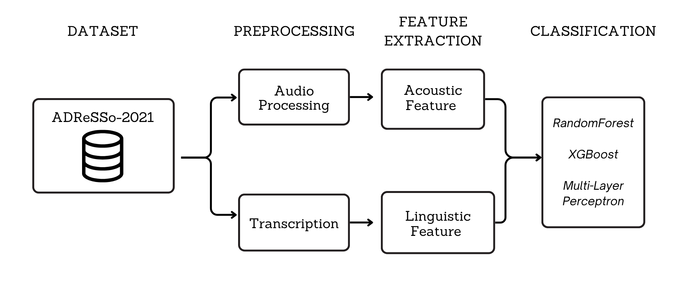

Alzheimer's dementia is a neurodegenerative disease that impairs memory and communication. Although there is no cure, early detection is important because identifying the disease early can slow its progression and lessen its effects. This work follows the ADReSSO challenge, exploring whether speech alone can serve as a reliable diagnostic signal. Something that, if successful, could make early screening both affordable and widely accessible. Using the ADReSSo-2021 corpus, this three-semester research project examined whether combining audio and text features could improve detection compared to a single-modality approach.

<figure class="post-figure">
  
  <figcaption>Overview of the multimodal pipeline: audio and transcribed speech yield acoustic and linguistic features used for classification.</figcaption>
</figure>

The ETL pipeline was designed to efficiently process and organize the audio dataset using parallelized processing and automatic logging to support large-scale experimentation. Each recording was processed with librosa and cropped to patient-only speech using the provided timestamps. Audio features were extracted with openSMILE (using the eGeMAPS feature set), and embeddings were generated with a pretrained wav2vec 2.0 model. DistilBERT produced linguistic embeddings from the transcripts, and before training, the audio and text vectors were concatenated into a single multimodal representation. We evaluated each configuration using Random Forest, XGBoost, and a Multi-Layer Perceptron, finding that text-based models consistently outperformed audio and multimodal ones—suggesting that transformer-based embeddings like those from BERT capture richer linguistic information than the speech representations from wav2vec 2.0. This research experience demystified embeddings for me; after experimenting with PCA to reduce noise in the high-dimensional vectors, I learned that while transformer models generate rich representations, they’re difficult to interpret and offer little control once produced.

<!-- [[Blog]](#) · -->
[[Poster]](https://github.com/Keene-AI-Lab/multimodal/blob/main/assets/Multimodal_Alzheimers_Detection.jpeg)
[[Code]](https://github.com/Keene-AI-Lab/multimodal)