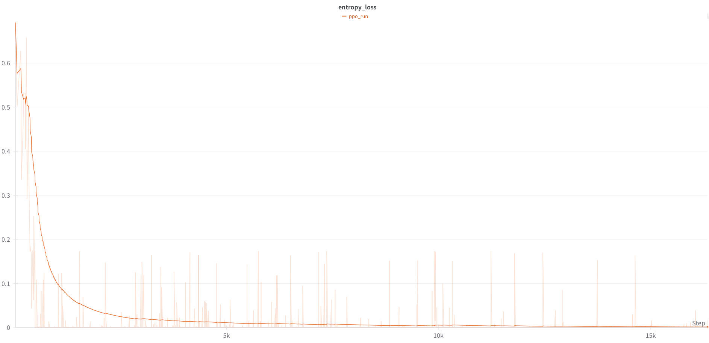
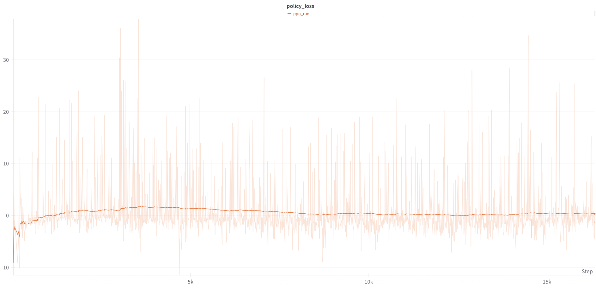
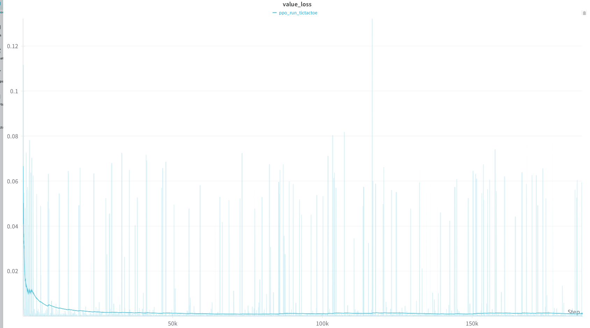

<figure class="post-figure">
  
  <figcaption>PPO reward curves across self-play sessions (CartPole, Tic-Tac-Toe, Checkers) showing convergence and variance.</figcaption>
</figure>

<figure class="post-figure">
  
  <figcaption>Win/draw/loss rates over evaluation episodes; Checkers agent reached a 56.5% win rate.</figcaption>
</figure>

<figure class="post-figure">
  
  <figcaption>Policy loss trends during training, monitored alongside value loss and entropy for stability.</figcaption>
</figure>

<figure class="post-table">
  <table>
    <thead>
      <tr>
        <th>Scenario</th>
        <th>Agent Wins</th>
        <th>Random Wins</th>
        <th>Draws</th>
        <th>Avg. Moves</th>
      </tr>
    </thead>
    <tbody>
      <tr>
        <td>Baseline</td>
        <td>502</td>
        <td>498</td>
        <td>0</td>
        <td>83.20</td>
      </tr>
      <tr>
        <td>After 1K games</td>
        <td>554</td>
        <td>446</td>
        <td>0</td>
        <td>162.75</td>
      </tr>
      <tr>
        <td>After 2K games</td>
        <td>548</td>
        <td>435</td>
        <td>0</td>
        <td>162.30</td>
      </tr>
      <tr>
        <td>After 5K (agent first)</td>
        <td>565</td>
        <td>450</td>
        <td>0</td>
        <td>161.03</td>
      </tr>
      <tr>
        <td>After 5K (random first)</td>
        <td>550</td>
        <td>450</td>
        <td>0</td>
        <td>159.89</td>
      </tr>
    </tbody>
  </table>
  <figcaption>Performance progression against random opponent. Win rate improved from 50% (baseline) to 56.5% after 5K games, while game length doubled as agents learned strategic play.</figcaption>
</figure>
