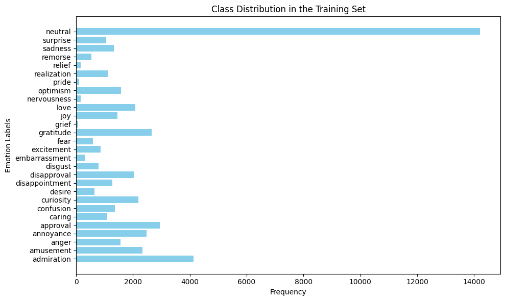
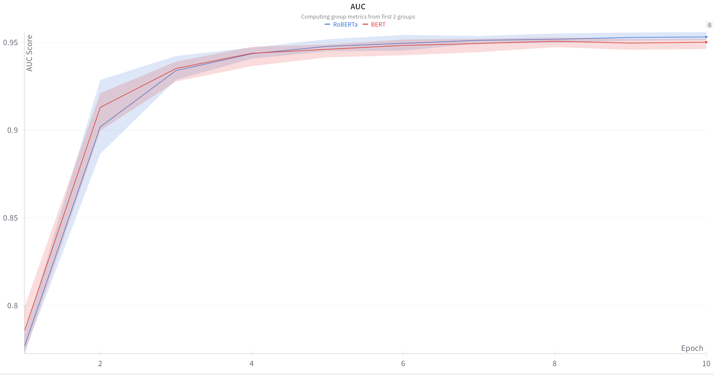

This project compared transformer architectures for emotion classification on the GoEmotions dataset.

<figure class="post-figure">
  
  <figcaption>Class distribution in GoEmotions highlights strong imbalance (e.g., joy and anger far outnumber pride or grief).</figcaption>
</figure>

<figure class="post-figure">
  
  <figcaption>RoBERTa converged to higher AUC than BERT under matched hyperparameters.</figcaption>
</figure>

<figure class="post-figure">
  
  <figcaption>Validation loss curves show RoBERTa stabilizing earlier and lower than BERT.</figcaption>
</figure>

<figure class="post-table">
  <table>
    <thead>
      <tr>
        <th>Model</th>
        <th>LR</th>
        <th>Batch</th>
        <th>Dropout</th>
        <th>AUC</th>
        <th>Train Loss</th>
        <th>Val Loss</th>
      </tr>
    </thead>
    <tbody>
      <tr>
        <td>BERT-base</td>
        <td>3e-5</td>
        <td>32</td>
        <td>0.3</td>
        <td>0.952</td>
        <td>0.073</td>
        <td>0.090</td>
      </tr>
      <tr>
        <td>RoBERTa-base</td>
        <td>3e-5</td>
        <td>32</td>
        <td>0.3</td>
        <td>0.956</td>
        <td>0.081</td>
        <td>0.088</td>
      </tr>
      <tr>
        <td>BERT-large</td>
        <td>3e-5</td>
        <td>32</td>
        <td>0.3</td>
        <td>0.953</td>
        <td>0.060</td>
        <td>0.097</td>
      </tr>
      <tr>
        <td>RoBERTa-large</td>
        <td>3e-5</td>
        <td>64</td>
        <td>0.3</td>
        <td>0.957</td>
        <td>0.078</td>
        <td>0.089</td>
      </tr>
      <tr>
        <td>DistilBERT</td>
        <td>3e-5</td>
        <td>64</td>
        <td>0.4</td>
        <td>0.948</td>
        <td>0.052</td>
        <td>0.096</td>
      </tr>
      <tr>
        <td>SqueezeBERT</td>
        <td>5e-5</td>
        <td>32</td>
        <td>0.3</td>
        <td>0.944</td>
        <td>0.092</td>
        <td>0.093</td>
      </tr>
    </tbody>
  </table>
  <figcaption>Best performing hyperparameter configurations for each transformer architecture. RoBERTa-large achieved the highest AUC of 0.957.</figcaption>
</figure>
